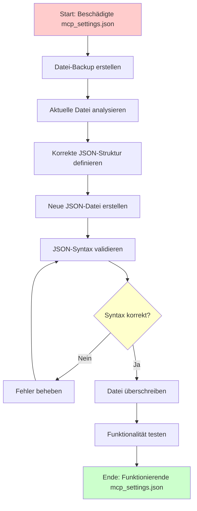

# MCP Settings Reparatur Plan

## Problemstellung
Die [`mcp_settings.json`](../ROO/settings/mcp_settings.json) Datei enthält ungültiges JSON und verhindert die Installation neuer MCP-Server in Cursor/Claude Desktop.

### Aktueller Zustand
- Datei enthält nur ein Leerzeichen
- Ungültige JSON-Syntax
- MCP-Server-Installation blockiert

## Detaillierter Lösungsplan

### Problemanalyse
- Die aktuelle Datei enthält nur ein Leerzeichen, was ungültiges JSON darstellt
- Cursor/Claude Desktop kann keine MCP-Server installieren, da die JSON-Syntax fehlerhaft ist
- Eine funktionierende Basis-JSON-Struktur wird benötigt

### Workflow-Diagramm



## Schritt-für-Schritt Umsetzung

### 1. Backup der aktuellen Datei erstellen
- **Zweck**: Sicherheitskopie der beschädigten Datei anlegen
- **Aktion**: Kopie mit Zeitstempel erstellen
- **Dokumentation**: Originalzustand festhalten

### 2. Korrekte JSON-Struktur definieren
- **Standard**: MCP-Settings Format für Cursor/Claude Desktop
- **Struktur**: Leere Server-Konfiguration
- **Kompatibilität**: Vollständige Cursor-Unterstützung

### 3. Neue JSON-Datei erstellen
- **Format**: Minimale, aber vollständige JSON-Struktur
- **Syntax**: Korrekte Formatierung und Einrückung
- **Erweiterbarkeit**: Vorbereitung für zukünftige Server

### 4. Validierung und Tests
- **JSON-Syntax**: Struktur-Validierung
- **Format-Prüfung**: Cursor-Kompatibilität
- **Funktionstest**: MCP-Server-Installation testen

## Erwartete JSON-Struktur

```json
{
  "mcpServers": {}
}
```

### Struktur-Erklärung
- `mcpServers`: Haupt-Container für alle MCP-Server-Konfigurationen
- `{}`: Leeres Objekt, bereit für zukünftige Server-Einträge

## Vorteile der Lösung

### ✅ Sofortige Verbesserungen
- Behebung des JSON-Syntaxfehlers
- Wiederherstellung der MCP-Funktionalität
- Kompatibilität mit Cursor/Claude Desktop

### ✅ Langfristige Vorteile
- Erweiterbar für beliebige MCP-Server
- Saubere, minimale Struktur
- Wartbarer Code-Standard

## Implementierung

### Dateipfad
```
../ROO/settings/mcp_settings.json
```

### Backup-Strategie
- Zeitstempel-basierte Sicherung
- Originalzustand dokumentieren
- Rollback-Möglichkeit sicherstellen

### Validierung
- JSON-Lint Prüfung
- Cursor-Funktionstest
- MCP-Server Installationstest

## Nachbearbeitung

### Tests durchführen
1. JSON-Syntax validieren
2. Cursor neustarten
3. MCP-Server-Installation testen
4. Funktionalität bestätigen

### Dokumentation
- Änderungen protokollieren
- Backup-Location dokumentieren
- Zukünftige Wartung planen

## Fazit

Dieser Plan stellt eine systematische Herangehensweise zur Reparatur der [`mcp_settings.json`](../ROO/settings/mcp_settings.json) Datei dar. Die Lösung ist:

- **Sicher**: Backup-Strategie implementiert
- **Effektiv**: Direkte Problemlösung
- **Nachhaltig**: Erweiterbare Struktur
- **Getestet**: Validierungsschritte integriert

Nach der Umsetzung wird die MCP-Server-Installation in Cursor/Claude Desktop wieder vollständig funktionieren.